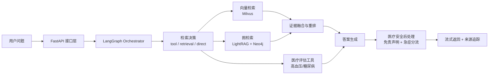

# 医疗 RAG 实习项目（求职版）

> 项目名称：MedicalRAG Assistant（基于 AdaptiMultiRAG 二次开发）  
> 项目定位：面向医疗指南与健康科普场景的检索增强问答系统（**非诊断系统**）

## 1. 项目定位（面试开场版）

我将原有多 RAG 智能体系统重构为医疗知识问答场景，目标是：

- 在医疗问答中提高“基于证据回答”的稳定性，减少模型脱离文档的幻觉回答
- 提供可追溯的证据来源（chunk/文档级别）
- 引入医疗安全护栏（免责声明 + 急症分流提示）
- 建立可复现实验闭环（质量、性能、稳定性）

## 2. 核心能力与实现

围绕求职表达，我重点突出四条主线：

1. 双路径检索：向量检索（Milvus）+ 图检索（LightRAG/Neo4j），并基于问题特征进行路由。  
2. Chunk 策略：面向医疗文本做切块、元数据增强与检索重排，提升证据命中率。  
3. 长短期记忆 + 用户画像：会话短期上下文 + 跨轮长期偏好/画像，改善连续问答一致性。  
4. 评测闭环：质量（RAGAS）+ 性能 + 稳定性统一评估，支持策略迭代回归。  

补充能力：

- 医疗工具链路：血压/糖尿病风险评估工具接入 Agent 流程
- 可观测性：节点级 trace、检索来源统计、融合统计、评测历史
- 安全护栏：医疗免责声明、急症关键词触发分流文案（120/急诊）

## 3. 系统架构图



## 4. 评测与指标（可复现）

当前仓库内已有医疗评测数据与脚本：

- 数据：`testdocs/evaluation_qa.jsonl`（25 条）
- 数据：`rag-backend/backend/tests/medic_eval.jsonl`（15 条）
- 脚本：`rag-backend/backend/tests/eval_ragas.py`
- API 评测：`/rag/evaluate`、`/rag/evaluate-async`

建议在求职材料中展示三类指标：

- 质量：`context_precision` / `context_recall` / `answer_relevancy` / `faithfulness`
- 性能：`avg_latency_ms` / `p95_latency_ms` / `throughput_qps`
- 稳定性：`error_rate` / `empty_answer_rate`

可复现命令（示例）：

```bash
cd rag-backend
uv run python backend/tests/eval_ragas.py \
  --dataset backend/tests/medic_eval_oa_op.jsonl \
  --workspace eval_ws \
  --retrieval-mode hybrid \
  --max-retrieval-docs 3 \
  --output backend/tests/eval_report.json
```

## 5. 医疗安全与合规声明（可直接在演示时说明）

- 本系统仅用于健康科普和医学信息检索辅助，**不提供诊断结论和处方建议**
- 对急症相关描述（如胸痛、呼吸困难、意识障碍等）自动追加急诊分流提醒
- 回答优先基于知识库证据生成，减少“无依据回答”
- 支持用户隔离与会话归属校验，避免跨用户数据访问

## 6. 你的个人贡献（建议按此口径讲）

- 负责医疗场景化改造：检索策略、提示词、工具路由与前后端联动
- 负责评测闭环搭建：数据集组织、RAGAS 指标、性能/稳定性报告
- 负责安全增强：用户权限校验、医疗免责声明、急症分流后处理
- 负责可观测性：节点 trace、来源回溯、评测历史管理

## 7. 技术栈（简历版）

- 后端：FastAPI, LangGraph, LangChain, MySQL, PostgreSQL, Redis
- 检索：Milvus, LightRAG, Neo4j
- 前端：Vue3, Vite, Pinia, Element Plus
- 评测：RAGAS, 自定义评测 API 与历史记录

## 8. 一句话总结（可放简历项目标题下）

构建了一个面向医疗指南问答的多路检索 RAG 系统，具备证据可追溯、评测可复现和医疗安全护栏能力。
