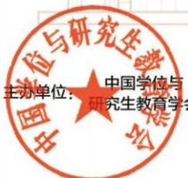
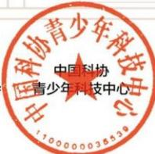
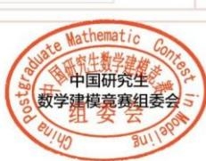
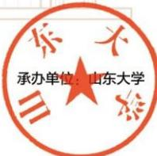

CPIPC中国研究生系列大赛

2024

“华为杯”第二十一届中国研究生数学建模竞赛

"HUAWEI Cup" The 21st China Post-Graduate Mathematical Contest in Modeling

获奖证书

新疆大学 斩凌霄 同学

荣获“华为杯”第二十一届中国研究生数学建模竞赛

二等奖

编号：E2024201707

二〇二四年十二月

# 获奖证书

certificate of award

新疆大学的参赛作品《基于深度学习的高速公路拥堵预测及应急车道启用模型研究》，在2025年（第十一届）全国大学生统计建模大赛新疆赛区赛区选拔赛中，荣获研究生组一等奖。

参赛队员：靳凌霄、陈欣宜、左燕妮

指导老师：刘淑娴

证书编号：20253802A0004

# 全国大学英语四级考试(CET4)成绩详情

姓名：靳凌霄

证件号码：410326199908245014

学校：南阳理工学院

# 笔试成绩

准考证号：418510211114302

总 分: 459

听力：158

阅 读：167

写作和翻译：134

# 口试成绩

准考证号：--

等级：--

成绩报告单编号：211141851003488

您在报名期间已选择需要纸质成绩报告单（证书），8月27日9时- 8月31日17时可再次登录报名网站进行修改。